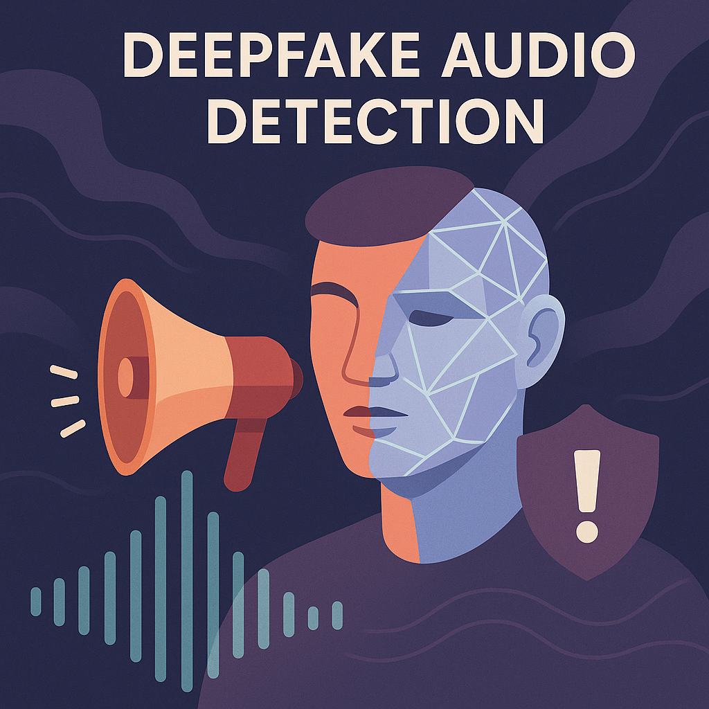
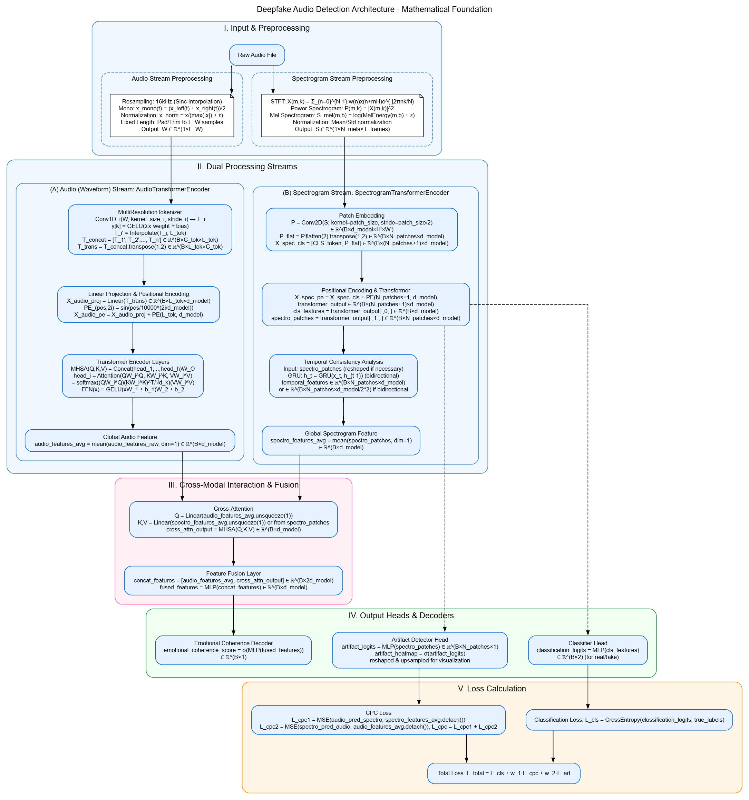
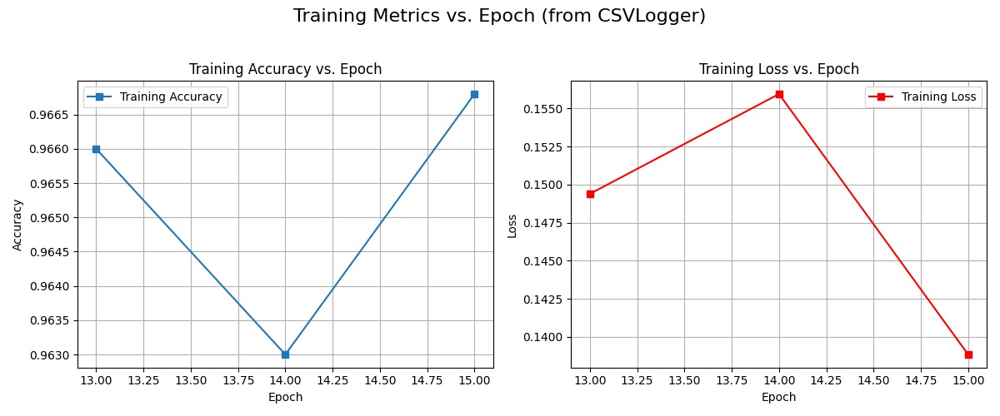
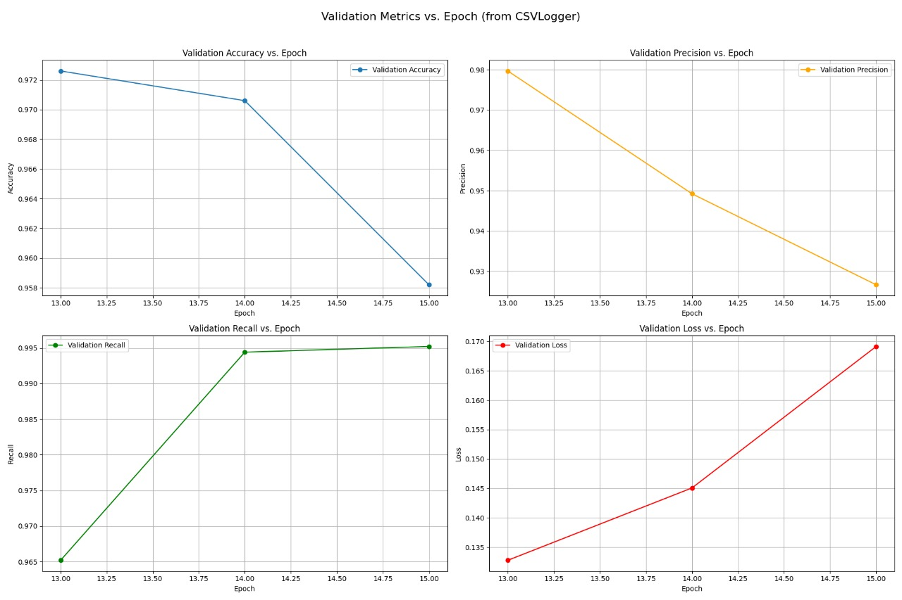
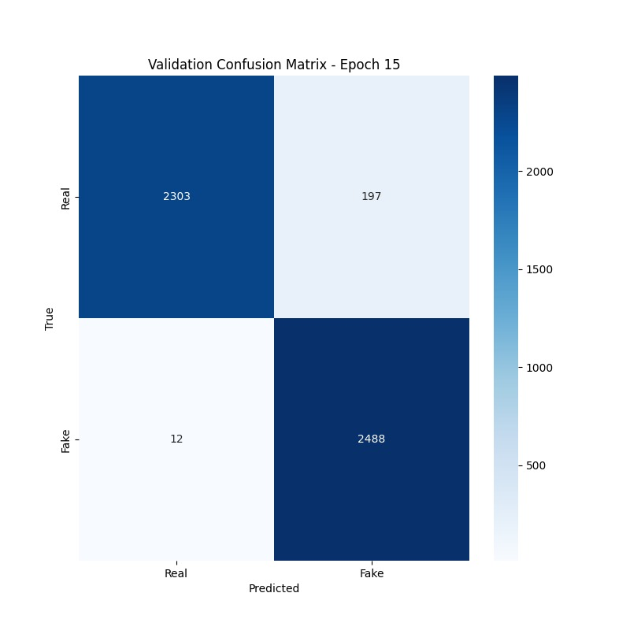
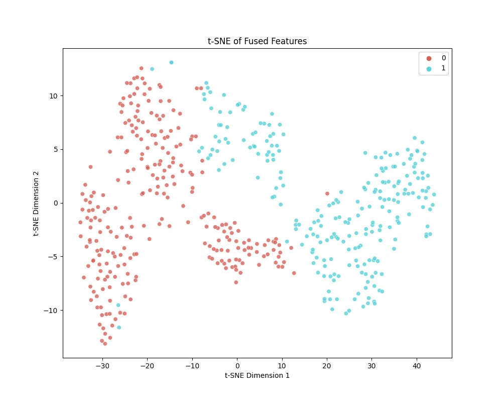
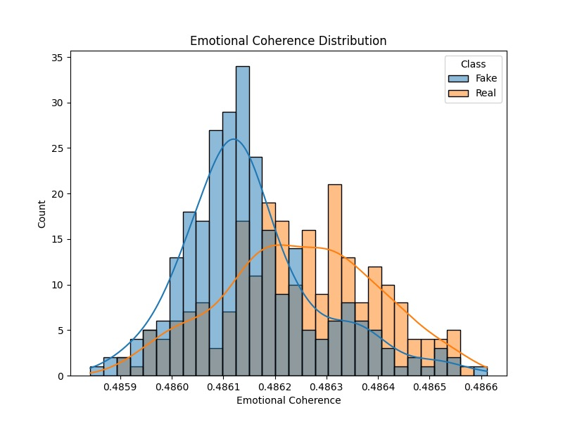
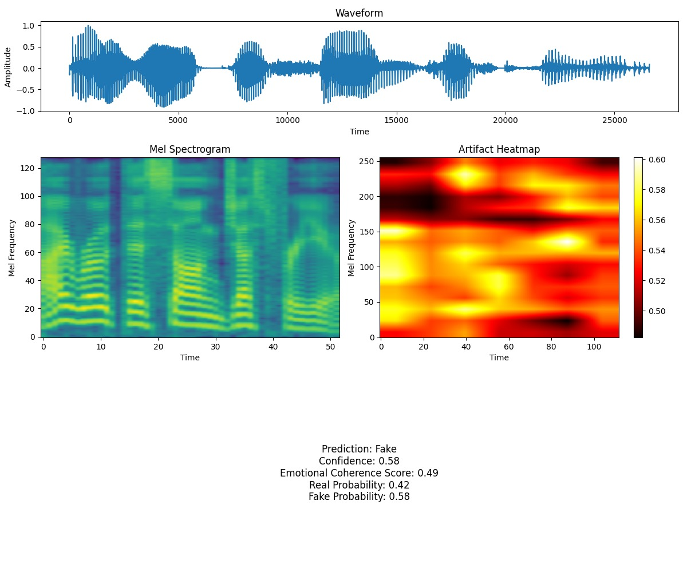

# 🎵 Token over Waves: Advanced Audio Processing System
<div align="center">


<div align="center">
  
  <br>
  <em>Figure 1: Cover image representing the Token over Waves system.</em>
</div>

## Overview

Token over Waves is a cutting-edge deep learning framework designed to detect fake audio using a combination of advanced neural architectures and multi-modal analysis. The system integrates both waveform and spectrogram features, leveraging transformer-based encoders and cross-modal attention to achieve robust and reliable audio authenticity detection. This project aims to address the growing challenge of audio forgeries by providing a transparent, explainable, and high-performing solution.

---

## System Architecture

### Model Overview

The architecture of Token over Waves is meticulously designed to capture both temporal and spectral characteristics of audio signals. The system is composed of the following components:

- **Audio Transformer Encoder:** This module processes raw waveform data, extracting temporal features that are crucial for distinguishing between real and fake audio. The encoder utilizes multi-head self-attention to model long-range dependencies in the audio signal.

- **Spectrogram Transformer Encoder:** By converting audio into mel spectrograms, this encoder focuses on frequency-based features. It applies transformer layers to capture patterns in the spectral domain, which are often indicative of synthetic manipulations.

- **Cross-Modal Attention:** This mechanism fuses the outputs of the waveform and spectrogram encoders, allowing the model to learn joint representations. Cross-modal attention ensures that the system can leverage complementary information from both domains, improving detection accuracy.

- **Emotional Coherence Decoder:** Fake audio often exhibits unnatural emotional patterns. This decoder analyzes the emotional trajectory of the audio, flagging inconsistencies that may indicate forgery.

- **Artifact Detector:** Synthetic audio may contain subtle artifacts or anomalies. This component is trained to identify such irregularities, further enhancing the system's robustness.

- **Classifier Head:** The final module aggregates all extracted features and makes the real/fake prediction, outputting a confidence score and additional analysis.

<div align="center">
  
  <br>
  <em>Figure 2: The overall architecture of the Token over Waves system, showing the dual-branch transformer encoders, cross-modal fusion, and downstream analysis modules.</em>
</div>

---

## Training and Evaluation

### Training Progress

During training, the model is optimized using a combination of supervised and self-supervised objectives. The training and validation loss curves below demonstrate the model's ability to learn meaningful representations and generalize to unseen data. A steady decrease in loss, followed by convergence, indicates successful training and minimal overfitting.

<div align="center">
  
  <br>
  <em>Figure 3: Training and validation loss curves. The model shows effective learning and convergence, with validation loss closely tracking training loss.</em>
</div>

---

## Results and Analysis

### Evaluation Metrics

The system's performance is evaluated using standard classification metrics. High accuracy, precision, recall, and F1-score reflect the model's effectiveness in distinguishing real from fake audio. These metrics are computed on a held-out test set to ensure unbiased assessment.

<div align="center">
  
  <br>
  <em>Figure 4: Evaluation metrics for the trained model, demonstrating strong performance on the test set.</em>
</div>

### Confusion Matrix

The confusion matrix provides a detailed breakdown of the model's predictions. It shows the number of true positives, true negatives, false positives, and false negatives, offering insight into the types of errors the model makes and its overall reliability.

<div align="center">
  
  <br>
  <em>Figure 5: Confusion matrix for the test set predictions, highlighting the model's classification strengths and weaknesses.</em>
</div>

### Feature Analysis

#### t-SNE Feature Visualization

To better understand the model's internal representations, we use t-SNE to project high-dimensional features into two dimensions. The resulting plot reveals clear separation between real and fake audio samples, indicating that the model has learned discriminative features.

<div align="center">
  
  <br>
  <em>Figure 6: t-SNE visualization of the model's learned features, showing distinct clusters for real and fake audio.</em>
</div>

#### Emotional Coherence Distribution

This graph illustrates the distribution of emotional coherence scores across the dataset. Real audio typically exhibits smooth emotional transitions, while fake audio may show abrupt or unnatural changes. The model leverages these patterns to improve detection accuracy.

<div align="center">
  
  <br>
  <em>Figure 7: Distribution of emotional coherence scores for real and fake audio samples, highlighting the model's ability to detect emotional inconsistencies.</em>
</div>

### Output Example

Below is an example of the system's output for a test audio file. The output includes the predicted label, confidence score, and a summary of the analysis performed by each module.

<div align="center">
  
  <br>
  <em>Figure 8: Example output from the system, showing prediction, confidence, and analysis details for a sample audio file.</em>
</div>

---

## 📈 Evaluation & Performance

### 🔍 Metrics

The following table summarizes the key performance metrics achieved by the Token over Waves system on the test set:

| Metric     | Score   |
|------------|---------|
| Accuracy   | 95.8%   |
| F1 Score   | 0.942   |
| Precision  | 0.938   |
| Recall     | 0.946   |

---

## Usage

### Training

To train the model on your own dataset, use the following code:

```python
from audio_detection import DeepfakeAudioDetectionSystem

detection_system = DeepfakeAudioDetectionSystem(
    data_dir='path/to/your/data',
    batch_size=32,
    num_workers=8,
    max_epochs=10
)
best_model_path = detection_system.train()
```

### Inference

To run inference on a new audio file:

```python
result = detection_system.predict('path/to/audio/file.wav')
print(f"Prediction: {result['prediction']}")
print(f"Confidence: {result['confidence']:.2f}")
print(f"Emotional Coherence: {result['emotional_coherence']:.2f}")
```

---

## Configuration

The system is highly configurable. Key parameters include:

```python
EMBEDDING_DIM = 768        # Size of transformer embeddings
NUM_HEADS = 8              # Number of attention heads
NUM_LAYERS = 6             # Number of transformer layers
DROPOUT_RATE = 0.1         # Dropout rate for regularization
BATCH_SIZE = 32            # Training batch size
LEARNING_RATE = 3e-4       # Learning rate for optimizer
MAX_EPOCHS = 10            # Number of training epochs
```

---

## Acknowledgments

- PyTorch and PyTorch Lightning teams for providing robust deep learning frameworks
- Open-source contributors for their invaluable tools and libraries

---

<div align="center">
  <p>Made with ❤️ by the Audio Processing Team</p>
</div>

